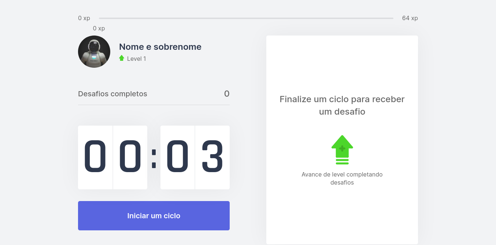

<h1 align="center">
   
  
   
</h1>

Aplicação que ajuda as pessoas a se exercitarem mais. Foi criada durante o NLW#4 da Rocketseat.

  

    

 

## :hammer: Tecnologias

Este projeto foi desenvolvido com as seguintes tecnologias:

- HTML5
- CSS
- React
- Next.js
- TypeScript

## 🚀 Execute o projeto

1. Clone este repositório `git clone https://github.com/dudunog/move.it.git`
2. Entre no diretório do projeto `cd move.it`
3. Instale as dependências com `yarn install` ou `npm install`
4. Inicie o projeto em modo desenvolvimento com `yarn dev`
